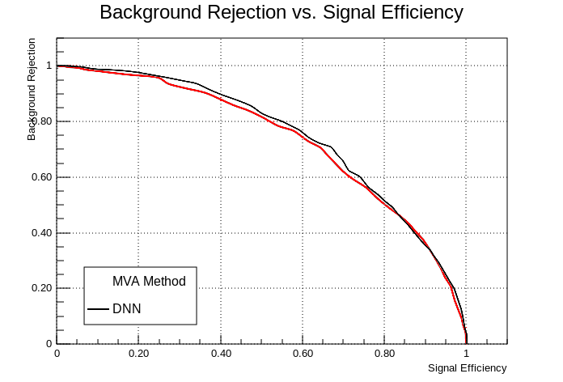

In my [last](./2016-06-14-a-first-prototype.md) blog post, I presented
a first prototype of a multi-architecture implementation of deep feedforward
neural networks. While the different components of the prototype were
thoroughly tested using unit tests, the next step was to integrate the
prototype into TMVA in order to  perform an end-to-end test of the system, which
compares the classification performance of the prototype to the performance of the
original implementation of deep neural networks in TMVA.

# Neural Network Training

So far I have not discussed how the training of the neural network prototype
will be performed. In general, neural networks are trained iteratively using
gradient-based optimization methods. This means in each step the weights
$\mathbf{W}^l$ and bias terms $\boldsymbol{\theta}^l$ of each layer $l$ are updated
based on the gradients of the loss function with respect to the weights and bias
terms:

\begin{align}
    \mathbf{W}^l &= \mathbf{W}^l + \Delta \mathbf{W} \left ( \frac{dJ}{d\mathbf{W}^l} \right ) \\
    \boldsymbol{\theta}^l &= \boldsymbol{\theta}^l + \Delta \boldsymbol{\theta} \left ( \frac{dJ}{d\boldsymbol{\theta}^l} \right ) \\
\end{align}

In general, the weight and bias-term updates, $\Delta \mathbf{W}^l$ and
$\Delta\boldsymbol{\theta}^l$ may depend also on the previous minimization steps that
have been performed. For now, however, we will only consider the simplest
gradient-based minimization method, namely
[gradient descent](https://en.wikipedia.org/wiki/Gradient_descent), where
the weight updates in each step are given by

\begin{align}
    \mathbf{W}^l &= \mathbf{W}^l - \alpha \frac{dJ}{d\mathbf{W}^l} \\
    \boldsymbol{\theta}^l &= \boldsymbol{\theta}^l - \alpha \frac{dJ}{d\boldsymbol{\theta}^l} \\
\end{align}

for a given *learning rate* $\alpha$.
Using the `scale_add` function defined in the low-level interface described in my
[previous post](./2016-06-14-a-first-prototype.md), a gradient descent step
can then be by performing forward and backward propagation and adding the computed
weights and bias gradients to the weights and biases of each layer.

```c++
net.Forward(input);
net.Backward(input, output);

for (size_t i = 0; i < net.GetDepth(); i++)
{
    auto &layer = net.GetLayer(i);
    scale_add(layer.GetWeights(), layer.GetWeightGradients(),
                1.0, -fLearningRate);
    scale_add(layer.GetBiases(), layer.GetBiasGradients(),
                1.0, -fLearningRate);
}
```
Note that `input` and `output` are the input events and expected
labels of a given *mini batch* in matrix form. The mini batches are
generated by shuffling the training set and splitting it up into mini
batches of the specified batch size.  Then, a *single* minimization
step is performed on each of the batches. The number of minimization
steps required to traverse the complete training set is
called an **epoch**. Convergence of the algorithm is determined by
periodically monitoring the loss or error on a validation
set. Convergence is assumed to be achieved when the minimum loss has
not been decreased for a given number of epochs.

The integration of the prototype into TMVA took me the last two weeks. The reason
for the delay is that I decided to also refactor the implementation of the
TMVA interface after discovering some bugs and shortcomings in the original
implementation of DNNs in TMVA.

# Results

For the testing, a subset of the higgs data set described in my
[first](./2016-04-28-tmva-dnn-1.md) blog post was used, which consists
of 9000 background and 9000 signal training events as well 1000 test
events of each class. The training was performed using a very simple neural net
consisting of 3 hiden layers with 100, 50 and 10 neurons with ReLU activation
functions for the first two hidden layers and identity activations on the last
one. The relevant TMVA configuration settings are given below:

```c++
TString configString = "!H:V";
configString += ":VarTransform=G";
configString += ":ErrorStrategy=CROSSENTROPY";
configString += ":WeightInitialization=XAVIERUNIFORM";
TString layoutString = "Layout=RELU|100,RELU|50,RELU|10,LINEAR";
TString trainingString = "TrainingStrategy="
                         "LearningRate=0.0005,"
                         "Momentum=0.0,"
                         "Repetitions=1,"
                         "ConvergenceSteps=10,"
                         "BatchSize=20,"
                         "Regularization=None,"
                         "TestRepetitions=15,"
                         "Multithreading=False";

configString += ":" + layoutString + ":" + trainingString;
TMVA::Types::EMVA method = TMVA::Types::kDNN;
factory->BookMethod(loader, method, "DNN", configString);
```

The rootbook used for the tests can be found 
[here](https://github.com/simonpf/rootbooks/blob/master/TMVA%20DNN.ipynb). The
training was performed using standard gradient descent with a learning rate
of $\alpha = 5 \times 10^{-4}$ and 10 steps without improvement in the minimum
network loss required for convergence (`ConvergenceSteps`). The trained networks
are evaluated by computing the [ROC curve](https://en.wikipedia.org/wiki/Receiver_operating_characteristic) of the corresponding classifier. The results are displayed in
the figure below. The black line displays the result from the prototype and the red
line the result from the original implementation. As can be seen from the plot,
both methods achieve nearly identical performance.

<div class="figure">

<p class="caption"><strong>Figure 1</strong>: ROC curve of the deep neural network
prototype trained on a subset of the Higgs dataset (black). The red curve displayes the
performance of the original implementation.</p>
</div>

The time required for the training of the neural networks were $231 s$ and $317 s$
 for the new prototype and the previous implementation, respectively. While
I do not expect the reference implementation to be numerically more efficient than
the previous implementation, the the reduction in training time may be due to the
face that the previous implementation did include bias term only for the input layer.
A more detailed analysis of the computational performance of the implementation will
follow in the coming weeks.

# Summary and Outlook

With the successful integration of the neural network prototype into
TMVA, an important milestone on the way towards GPU-accelerated
training of neural networks in TMVA was achieved. The prototype
currently implements the core functionality required to train and
evaluate the neural network. Moreover, the reference implementation
and the generic unit tests developed so far should considerably
simplify the implementation of hardware-specific backends. The next
step from here will be to implement a first GPU backend in order demonstrate
the capabilities of the current design.
